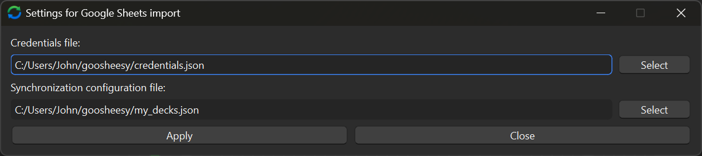
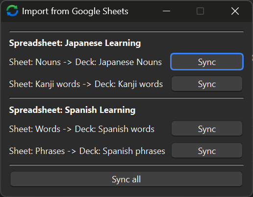

# Anki add-on for importing cards from Google Sheets

Google Sheets Syncer - goosheesy

Anki addon for importing cards from spreadsheet tables on Google Sheets.

It's best suited and tested on importing the translation pairs in form "word-translation".

## Installation

* To install package version from AnkiWeb, follow the instruction: https://ankiweb.net/shared/info/258119705 
* To install manually, download the add-on package from GitHub releases page, and click in Anki `Tools`->`Add-ons`->`Install from file`.

## Usage Flow

Before using the add-on, you have to configure the `credentials.json` file so that the add-on can access sheets in your Google Sheets account, and `import_config.json` file which defines mapping between Google Sheets and Anki decks.

The most complex step is to create the `credentials.json` file which will allow the add-on to access the data on Google Sheets.
This file is created in [console.cloud.google.com](console.cloud.google.com).

Create `import_config.json` file which maps your Google Sheets to Anki decks, for example:

```json
{
   "synchronization_map":[
      {
         "spreadsheet_name":"My Japanese Vocabulary spreadsheet",
         "sheets":[
            {
               "sheet_name":"Japanese Google Sheet",
               "deck_name":"Japanese Anki deck"
            },
            {
               "sheet_name":"My second sheet",
               "deck_name":"My second deck"
            }
         ]
      }
   ]
}
```

Each sheet in the spreadsheet is one-way synchronized into the Anki deck.

Use add-on in Anki:

* Launch Anki.
* Press `Tools`->`Settings for Google Sheets import`.
   * Select the `credentials.json` file.
   * After the setup, the settings will look like following:

      
* Press `Tools`->`Import from Google Sheets`. If everything is configured correctly during previous steps, the window will look like following:

   

## Development

Anki add-on development has some nuances.

To prepare the project for development:

* Clone the repo.
* In order for Anki to download the add-on from the source code of repository, create a symlink:
    * On Windows:
        ```powershell
        New-Item -Path C:\Users\MyUserName\AppData\Roaming\Anki2\addons21\goosheesy -ItemType SymbolicLink -Value C:\Users\MyUserName\source\repos\anki_addon_sheets
        ```
    * On Linux:
        ```bash
        TODO
        ```
* Install regular packages:
```shell
pip install -r requirements.txt -t ./vendor
```
* Install development packages:
```shell
python -m pip install -r requirements_dev.txt -t ./addon_packages_dev
```

### Debugging

In `__init__.py`, set `WAIT_FOR_DEBUGGER_ATTACHED` variable to `True`.

To debug, launch Anki first. It will freeze and won't launch until you hit F5 in VSCode and attach the debugger to the add-on.

## Deployment

* Ensure dependency modules are installed.
* Increase version number.
* Create addon package archive by running the `package_addon` script.
* Upload to https://ankiweb.net/shared/addons.
* Upload to releases page on GitHub.

## Useful links

* https://addon-docs.ankiweb.net/intro.html
* https://ankiweb.net/shared/addons
* https://github.com/ankidroid/Anki-Android/wiki/Database-Structure
* Anki Python API: https://addon-docs.ankiweb.net/the-anki-module.html
* Python modules: https://addon-docs.ankiweb.net/python-modules.html

## Notes

* Import of several sheets into the same deck is not supported at the moment.

## License

Licensed under the MIT license. Distribution is free, copyright notice is required.
